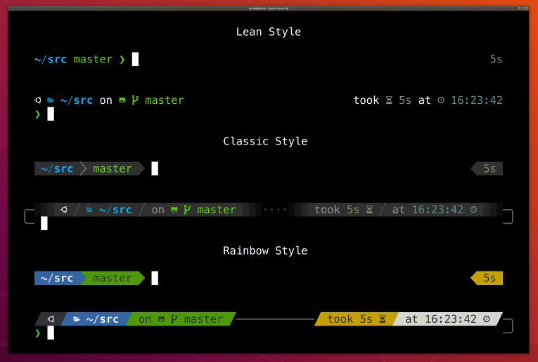
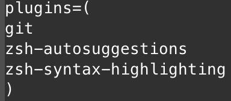

# Server Setup

Created: Mar 31, 2023
Updated: Nov 28, 2023 (by Zilong Wang)

## 0. SSH-Key

`ssh-copy-id -i ~/.ssh/id_rsa.pub YOUR_USER_NAME@IP_ADDRESS_OF_THE_SERVER`

## 1. oh-my-zsh

1. Install zsh+omz

   - https://github.com/ohmyzsh/ohmyzsh/wiki/Installing-ZSH
   - https://ohmyz.sh/#install

     ```bash
     # Install Zsh
     sudo apt install zsh
     sh -c "$(wget https://raw.githubusercontent.com/ohmyzsh/ohmyzsh/master/tools/install.sh -O -)"
     ```
2. Themes
   - `Powerlevel10k`: https://github.com/romkatv/powerlevel10k
   - 
   - Install:
     ```bash
     git clone --depth=1 https://github.com/romkatv/powerlevel10k.git ${ZSH_CUSTOM:-~/.oh-my-zsh/custom}/themes/powerlevel10k
     ```
   - Set `ZSH_THEME="powerlevel10k/powerlevel10k"` in `.zshrc`
   - Solve bugs: add `unset ZSH_AUTOSUGGEST_USE_ASYNC` at the bottom of `.zshrc`

3. Plugins 
   - git
   - zsh-autosuggestions: 
     - `git clone https://github.com/zsh-users/zsh-autosuggestions ${ZSH_CUSTOM:-~/.oh-my-zsh custom}/plugins/zsh-autosuggestions`
   - zsh-syntax-highlighting:
     - `git clone https://github.com/zsh-users/zsh-syntax-highlighting.git ${ZSH_CUSTOM:-~/.oh-my-zsh/custom}/plugins/zsh-syntax-highlighting`
   - In `.zshrc`: 

## 2. Conda

1. Recommend to use `miniconda` and use a separate env other than `base` for development (so that if you somehow ruin your `env` in use, you can simply reinstall it.)

```bash
mkdir -p ~/miniconda3
wget https://repo.anaconda.com/miniconda/Miniconda3-latest-Linux-x86_64.sh -O ~/miniconda3/miniconda.sh
bash ~/miniconda3/miniconda.sh -b -u -p ~/miniconda3
rm -rf ~/miniconda3/miniconda.sh
```

2. Create Environment

```bash
conda create -n general python=3.X
```

## 3. PyTorch

1. Web Page: https://pytorch.org/get-started/locally/

2. Install a specific cuda toolkit
  
   
   * **Option 1: manually install the cuda toolkit**
     - Google search for the runfile of the right version
     - `sudo sh cuda_XXX_linux.run`
     - Double check the symlink in `/usr/local/cuda`
     - Add this to the .zshrc or .bashrc
       ```bash
       #cuda
       export CUDA_HOME=/usr/local/cuda
       export LD_LIBRARY_PATH=$LD_LIBRARY_PATH:/usr/local/cuda/lib64
       export PATH=/usr/local/cuda/bin:$PATH
       ```
   
   * **Option 2: install cuda toolkit as a package in conda env**
     - All you need is simply `nvcc`
     - https://anaconda.org/nvidia/cuda-nvcc
       - `conda install -c nvidia cuda-nvcc`
       - `conda install -c "nvidia/label/cuda-1X.X.X" cuda-nvcc`
     - Make sure there is no code to import/specify the `cuda` directory in your `.bashrc` or `.zshrc`
      
3. Check `nvcc` version: `nvcc -V`
4. Why do my `ncvv -v` and `nvida-smi` show different versions?
   * `nvidia-smi` shows the highest cuda version the current cuda env supports. (could be higher than your actual cuda version).
   * `nvcc -v` is your true cuda version.


## 3. Tmux

`.tmux.conf`: 
```bash
wget https://raw.githubusercontent.com/Shang-Data-Lab/CodeBase/main/server_setup/tmux.conf
mv tmux.conf .tmux.conf
```


## 4. Vim 

`.vimrc`: https://github.com/amix/vimrc
```bash
git clone --depth=1 https://github.com/amix/vimrc.git ~/.vim_runtime
sh ~/.vim_runtime/install_basic_vimrc.sh

echo "set cursorline" >> .vimrc
```


